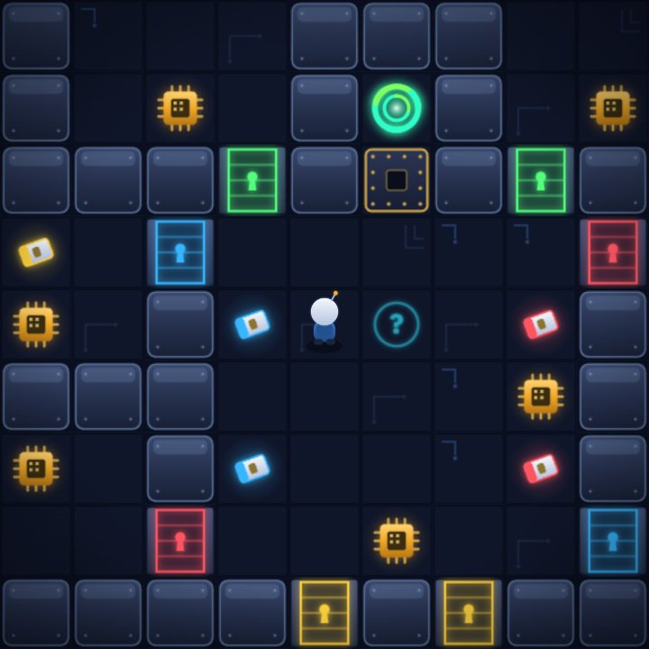

# Chip's Challenge — Neon Circuit Remake

A fan-made, browser-based remake of the classic 1989 tile puzzler, built from scratch:
an original game engine, an original procedurally-drawn "neon circuit" tileset, and
synthesized audio — no game assets are copied or bundled.

The engine plays the classic MS-ruleset levels from a standard `.DAT` level file
(such as the original `CHIPS.DAT`), which you supply yourself.



## Running it

The repo deliberately **does not include level data** (the original levels are
copyrighted). To play:

1. Obtain a CC1 level file — e.g. the `CHIPS.DAT` from your own copy of the game.
2. Drop it at `original/CHIPS.DAT`.
3. Either:
   - **Embed it** (lets the game run from a double-clicked `index.html`):
     ```sh
     node tools/embed.mjs        # writes js/levels-data.js
     ```
   - **Or serve the folder** (the game falls back to fetching `original/CHIPS.DAT`):
     ```sh
     python3 -m http.server 8741
     # open http://localhost:8741
     ```

Any CC1-format `.DAT` level set works, not just the original one.

## Controls

| Key | Action |
| --- | --- |
| Arrows / WASD | Move |
| R | Restart level |
| P / Esc | Pause |
| L | Level list |
| M | Mute |
| [ / ] | Previous / next unlocked level |

Progress, best times, and unlocks are stored in `localStorage`. Level passwords
from the data file work in the password box on the title screen.

## What's implemented

MS-ruleset mechanics: walls, dirt, gravel, water/fire (+ matching boots), ice and
ice corners with sliding & bouncing, force floors (+ suction boots, perpendicular
override), pushable blocks (water → dirt, bombs, crushing), all four key/door
colors, sockets, thieves, hint tiles, popup walls, invisible/appearing walls,
blue fake/real walls, toggle walls + green buttons, tank reversal + blue buttons,
traps + brown buttons, clone machines + red buttons, teleports, bombs, and the
nine monster types with their classic movement AIs (bug, paramecium, fireball,
glider, ball, tank, walker, blob, teeth). Timed levels, chip counters, hints,
passwords, and per-level best times are all in.

A few deep MS quirks (slip-list ordering, boosting, even-step parity) are
intentionally simplified.

## Project layout

```
index.html            app shell
css/style.css         neon-arcade UI theme
js/dat.js             CC1 .DAT parser
js/tiles.js           tile constants + procedural tileset & entity painters
js/engine.js          game logic (tick-based, MS-style rules)
js/render.js          canvas renderer: camera, atlas, particles
js/audio.js           WebAudio synthesized SFX
js/main.js            screens, HUD, input, persistence, main loop
tools/verify-dat.mjs  parse + validate a .DAT, ASCII-dump a level
tools/embed.mjs       embed a .DAT into js/levels-data.js
tools/sim.mjs         headless engine tests (node tools/sim.mjs)
```

## Tests

```sh
node tools/sim.mjs    # 18 headless gameplay assertions against the engine
```

## Credits

- Chip's Challenge was created by Chuck Sommerville; the game concept and the
  original level designs remain the property of their respective owners.
- Engine code, artwork (all drawn in canvas at runtime), sounds, and UI here are
  original work for this remake.
- Fonts: [Bungee](https://fonts.google.com/specimen/Bungee) and
  [IBM Plex Mono](https://fonts.google.com/specimen/IBM+Plex+Mono) (SIL OFL),
  loaded from Google Fonts.

This is a personal, non-commercial fan project.
